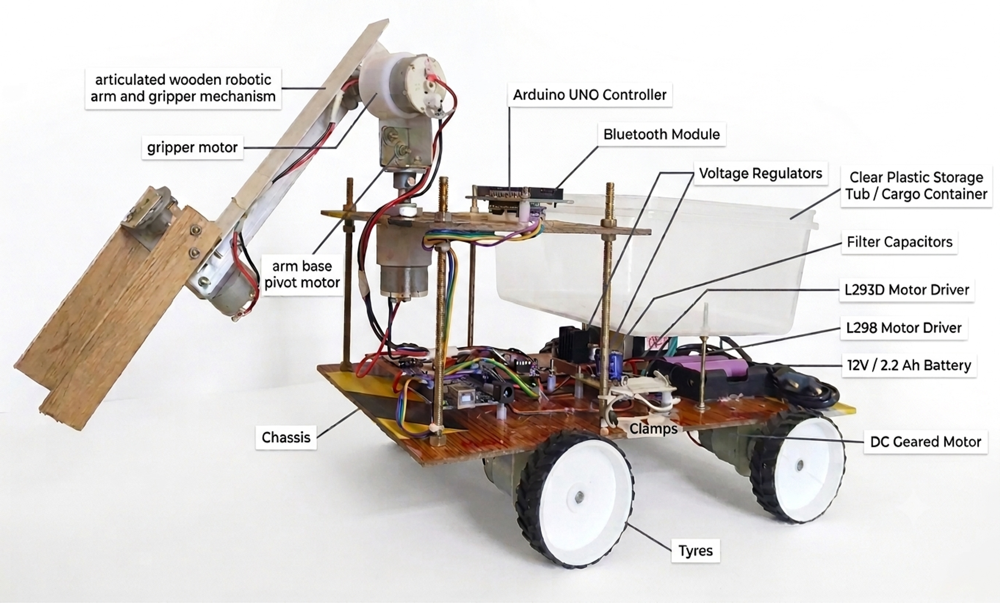
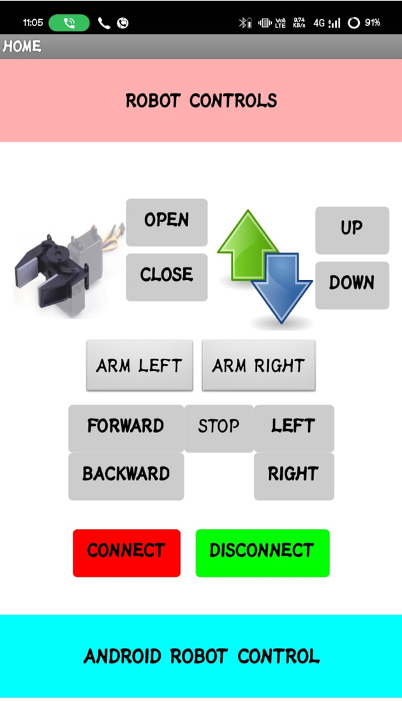
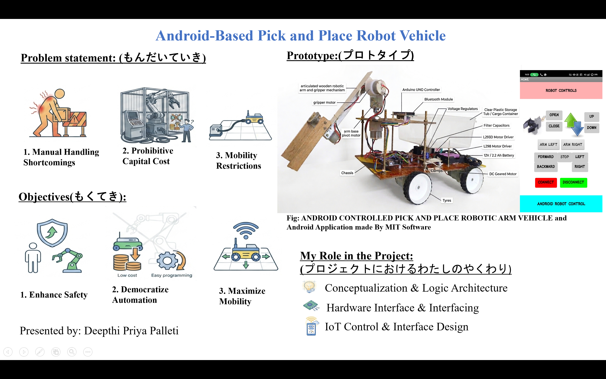
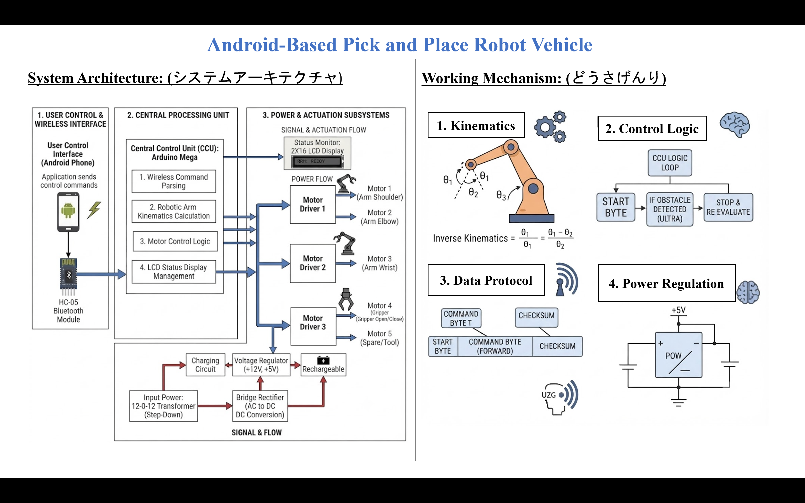
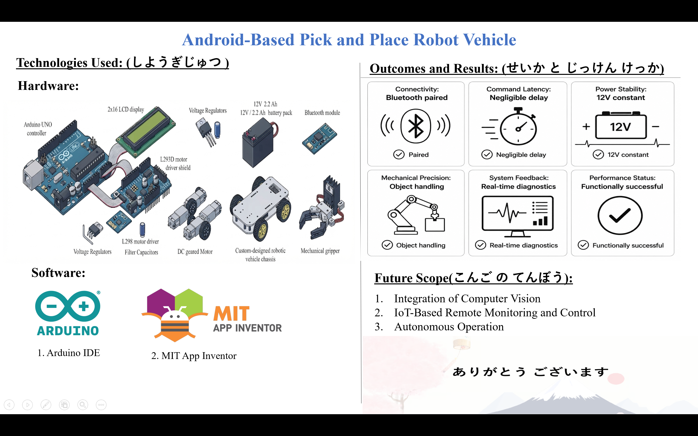

# Android-Based-Pick-and-Place-Robot-Vehicle
This Android-controlled robot uses an Arduino and Bluetooth for remote pick-and-place tasks. By combining a mobile base with a robotic arm, it navigates and moves objects safely. The project demonstrates skills in embedded C++, hardware integration, and wireless communication, providing a smart, automated solution for industrial material handling.
## Key Features
- **Remote Operation:** Controlled wirelessly via Bluetooth from an Android device.
- **Mobility:** Features a 4-wheel drive system for omnidirectional movement.
- **Manipulation:** Equipped with a servo-controlled robotic arm for precise object handling.
- **Feedback:** Uses an LCD display to provide real-time status updates on the robot's current action.

## Technologies Used
- **Programming:** Embedded C++ (Arduino)
- **Hardware:** Arduino Uno, Bluetooth Module (HC-05), Servo Motors, DC Motors, L293D Motor Driver
- **Connectivity:** Bluetooth Serial Communication

## Project Gallery

### Prototype Design

### Android App Interface

## Project Demo
Click the image below to watch the demo on Google Drive:

## Project Presentation

